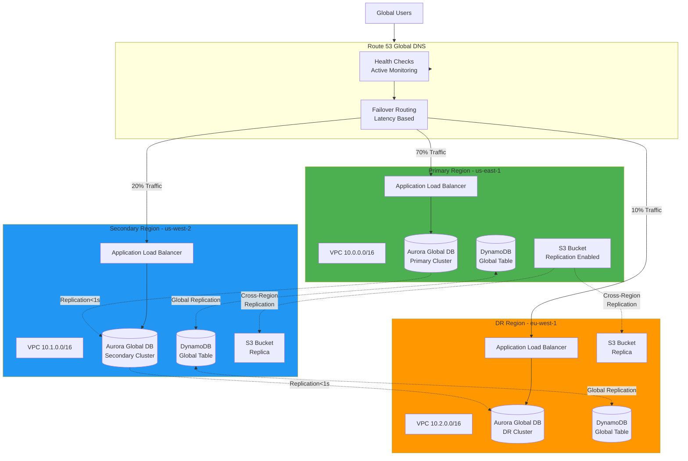

## 🏗️ High-Level Architecture

```mermaid
graph TB
    Users[Global Users]
    
    subgraph Route53["Route 53 Global DNS"]
        HealthChecks[Health Checks<br/>Active Monitoring]
        Failover[Failover Routing<br/>Latency Based]
    end
    
    subgraph Primary["Primary Region - us-east-1"]
        VPC1[VPC 10.0.0.0/16]
        ALB1[Application Load Balancer]
        Aurora1[(Aurora Global DB<br/>Primary Cluster)]
        DynamoDB1[(DynamoDB<br/>Global Table)]
        S3_1[S3 Bucket<br/>Replication Enabled]
    end
    
    subgraph Secondary["Secondary Region - us-west-2"]
        VPC2[VPC 10.1.0.0/16]
        ALB2[Application Load Balancer]
        Aurora2[(Aurora Global DB<br/>Secondary Cluster)]
        DynamoDB2[(DynamoDB<br/>Global Table)]
        S3_2[S3 Bucket<br/>Replica]
    end
    
    subgraph DR["DR Region - eu-west-1"]
        VPC3[VPC 10.2.0.0/16]
        ALB3[Application Load Balancer]
        Aurora3[(Aurora Global DB<br/>DR Cluster)]
        DynamoDB3[(DynamoDB<br/>Global Table)]
        S3_3[S3 Bucket<br/>Replica]
    end
    
    Users --> Route53
    Route53 --> HealthChecks
    HealthChecks --> Failover
    
    Failover -->|70% Traffic| ALB1
    Failover -->|20% Traffic| ALB2
    Failover -->|10% Traffic| ALB3
    
    ALB1 --> Aurora1
    ALB2 --> Aurora2
    ALB3 --> Aurora3
    
    Aurora1 -.->|Replication<1s| Aurora2
    Aurora2 -.->|Replication<1s| Aurora3
    
    DynamoDB1 <-.->|Global Replication| DynamoDB2
    DynamoDB2 <-.->|Global Replication| DynamoDB3
    
    S3_1 -.->|Cross-Region<br/>Replication| S3_2
    S3_1 -.->|Cross-Region<br/>Replication| S3_3
    
    style Primary fill:#4CAF50
    style Secondary fill:#2196F3
    style DR fill:#FF9800
```
