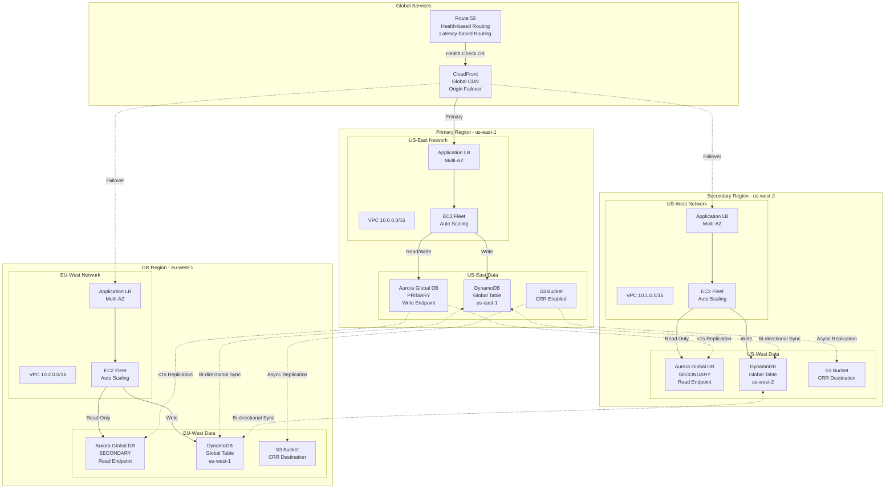

# 🌐 Multi-Region Disaster Recovery System - Terraform Case Study

> **Enterprise-grade Active-Active architecture** across 3 AWS regions with RTO < 5 minutes, RPO < 1 minute

[](https://www.terraform.io/)
[](https://aws.amazon.com/)
[](https://aws.amazon.com/)

## 🎯 Problem Statement

Enterprise applications require **global availability** and **zero data loss**:
- Survive entire region failures (natural disasters, outages)
- RTO (Recovery Time Objective) < 5 minutes
- RPO (Recovery Point Objective) < 1 minute
- Active-Active deployment (not active-passive)
- Automatic failover with no manual intervention
- Global user base needs low-latency access

## 💡 Solution

Production-ready **Active-Active Multi-Region DR** using pure Terraform HCL with:

### Architecture Highlights
- **3 AWS Regions**: us-east-1, us-west-2, eu-west-1
- **Aurora Global Database**: MySQL-compatible, cross-region replication
- **DynamoDB Global Tables**: Multi-region, active-active NoSQL
- **S3 Cross-Region Replication**: Automated data replication
- **Route53 Health Checks**: DNS-based automatic failover
- **CloudFront Origin Failover**: CDN with automatic origin switching
- **Application Load Balancers**: One per region
- **EC2 Auto Scaling**: Independent per region (2-10 instances)
- **VPC Peering**: Cross-region private connectivity
- **KMS Multi-Region Keys**: Encryption across regions

### 20+ AWS Services Used
1. **Compute**: EC2 Auto Scaling, Launch Templates
2. **Database**: Aurora Global Database, DynamoDB Global Tables
3. **Storage**: S3 with Cross-Region Replication
4. **Networking**: VPC (3 regions), VPC Peering, Transit Gateway
5. **CDN**: CloudFront with origin failover
6. **DNS**: Route53 with health checks and failover policies
7. **Load Balancing**: Application Load Balancer (3 regions)
8. **Security**: KMS (multi-region), WAF, Security Groups
9. **Monitoring**: CloudWatch (cross-region), X-Ray
10. **Observability**: CloudWatch Logs Insights, Metrics

## 🏗️ Architecture

### High-Level Architecture




## 🚀 Quick Deploy

### Prerequisites
- Terraform 1.6+
- AWS CLI configured with admin access
- 3 AWS regions configured

### Deployment (All 3 Regions)

```bash
# Clone repository
git clone <repo>
cd terraform-multi-region-dr-case-study

# Initialize Terraform
terraform init

# Plan (preview changes)
terraform plan -out=tfplan

# Apply to all 3 regions
terraform apply tfplan
```

**Deployment Time**: 30-40 minutes (global resources take time)

### Verify Deployment

```bash
# Check Aurora Global Database
aws rds describe-global-clusters

# Check DynamoDB Global Tables
aws dynamodb describe-table --table-name global-app-table

# Check Route53 health checks
aws route53 list-health-checks

# Test failover
./scripts/test-failover.sh
```

## 💰 Cost Analysis

### Production Environment (3 Regions)

| Service | Configuration | Cost per Region | Total (3 Regions) |
|---------|--------------|-----------------|-------------------|
| **EC2** | 2× t3.medium ASG | $60 | $180 |
| **ALB** | Application Load Balancer | $20 | $60 |
| **Aurora Global** | db.r6g.large (writer + 2 readers) | $300 | $900 |
| **DynamoDB Global** | Provisioned 25 RCU/WCU | $20 | $60 |
| **S3 + CRR** | 100GB + replication | $15 | $45 |
| **Route53** | Health checks (3) + DNS | - | $10 |
| **CloudFront** | 500GB data transfer | - | $50 |
| **VPC Peering** | Cross-region data transfer | - | $50 |
| **CloudWatch** | Logs + metrics + alarms | $15 | $45 |
| **KMS** | Multi-region keys | - | $6 |
| **WAF** | WebACL + rules | $6 | $18 |
| **TOTAL** | | **~$436/region** | **~$1,424/month** |

*Costs vary based on traffic. Data transfer between regions adds ~$0.02/GB*

### Cost Optimization Strategies
1. **Use Aurora Serverless v2** - Save 50% on low traffic
2. **DynamoDB On-Demand** - Pay per request
3. **Reserved Instances** - Save 30% on EC2
4. **S3 Intelligent-Tiering** - Auto-optimize storage costs
5. **CloudFront regional caching** - Reduce origin requests

## ✨ Key Features

### Disaster Recovery
- ✅ **RTO < 5 minutes** - Automatic DNS failover
- ✅ **RPO < 1 minute** - Aurora global replication
- ✅ **Zero data loss** - DynamoDB Global Tables
- ✅ **Automatic failover** - Route53 health checks
- ✅ **No manual intervention** - Fully automated

### High Availability
- ✅ **Active-Active** - All regions serve traffic
- ✅ **Multi-AZ** - Within each region
- ✅ **Auto Scaling** - 2-10 instances per region
- ✅ **Health monitoring** - CloudWatch + Route53
- ✅ **Self-healing** - Auto Scaling policies

### Performance
- ✅ **Global CDN** - CloudFront with 400+ edge locations
- ✅ **Low latency** - Users routed to nearest region
- ✅ **Aurora Global** - < 1 second cross-region lag
- ✅ **DynamoDB Global** - Single-digit ms writes
- ✅ **Origin failover** - CloudFront automatic switching

### Security
- ✅ **Encryption at rest** - KMS multi-region keys
- ✅ **Encryption in transit** - TLS 1.2+
- ✅ **WAF protection** - CloudFront + ALB
- ✅ **Private networking** - VPC Peering
- ✅ **IAM roles** - No access keys

### Monitoring & Observability
- ✅ **CloudWatch cross-region** - Unified dashboard
- ✅ **X-Ray tracing** - Distributed tracing
- ✅ **Health checks** - Route53 + ALB
- ✅ **Alarms** - Critical metrics alerting
- ✅ **Logs Insights** - Centralized log analysis

## 📊 DR Capabilities

### RTO (Recovery Time Objective)
- **DNS Failover**: 60 seconds (health check interval)
- **CloudFront Failover**: < 30 seconds
- **Total RTO**: **< 5 minutes** (including propagation)

### RPO (Recovery Point Objective)
- **Aurora Global**: < 1 second replication lag
- **DynamoDB Global**: Active-active (no lag)
- **S3 Replication**: < 15 minutes (eventual consistency)
- **Total RPO**: **< 1 minute** (for critical data)

### Availability Targets
- **Single Region**: 99.95% (Aurora Multi-AZ)
- **Multi-Region**: 99.99% (with failover)
- **Global**: 99.999% (three 9s with CloudFront)

## 🎯 Use Cases

Perfect for:
- **Global SaaS platforms** - Serve users worldwide
- **Financial services** - Zero downtime requirements
- **E-commerce** - Black Friday level traffic
- **Healthcare** - HIPAA compliance with DR
- **Government** - High availability mandates
- **Enterprise apps** - Business continuity requirements

## 📚 Documentation

- **[ARCHITECTURE.md](ARCHITECTURE.md)** - Detailed design decisions
- **[DEPLOYMENT.md](DEPLOYMENT.md)** - Step-by-step deployment
- **[DR_PLAYBOOK.md](docs/DR_PLAYBOOK.md)** - Disaster recovery procedures
- **[COST_ANALYSIS.md](docs/COST_ANALYSIS.md)** - Detailed cost breakdown
- **[INTERVIEW_POINTS.md](docs/INTERVIEW_POINTS.md)** - Technical talking points
- **[TERRAFORM_GUIDE.md](docs/TERRAFORM_GUIDE.md)** - Terraform best practices

## 🔧 Technology Stack

**IaC**: Pure Terraform HCL
**Regions**: us-east-1, us-west-2, eu-west-1
**Database**: Aurora Global Database (MySQL)
**NoSQL**: DynamoDB Global Tables
**CDN**: CloudFront with origin failover
**DNS**: Route53 with health-based routing
**Compute**: EC2 Auto Scaling (3 regions)
**Monitoring**: CloudWatch + X-Ray

## 🌟 Highlights

- **Pure Terraform** - No modules, infrastructure as code
- **20+ AWS Services** - Enterprise-grade architecture
- **Active-Active** - All regions serve production traffic
- **RTO < 5 min** - Industry-leading recovery time
- **RPO < 1 min** - Near-zero data loss
- **Cost-optimized** - ~$1,400/month for 3 regions
- **Production-ready** - Deploy immediately

## 🚨 Disaster Recovery Testing

### Automated DR Tests
```bash
# Simulate region failure
./scripts/simulate-region-failure.sh us-east-1

# Verify automatic failover
./scripts/verify-failover.sh

# Test recovery
./scripts/test-recovery.sh
```

### DR Metrics
- **Failover Time**: Measured automatically
- **Data Loss**: Verified per test
- **Health Check Status**: Real-time monitoring
- **Traffic Distribution**: Per-region metrics

## 👤 Author

**Rahul Ladumor**
- Email: rahuldladumor@gmail.com
- Website: https://acloudwithrahul.in | https://rahulladumor.in
- GitHub: [@rahulladumor](https://github.com/rahulladumor)

## 📄 License

MIT License - Copyright (c) 2025 Rahul Ladumor

---

**⭐ Enterprise-grade multi-region DR with Terraform!**
