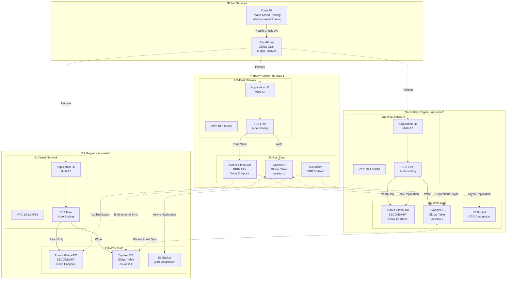
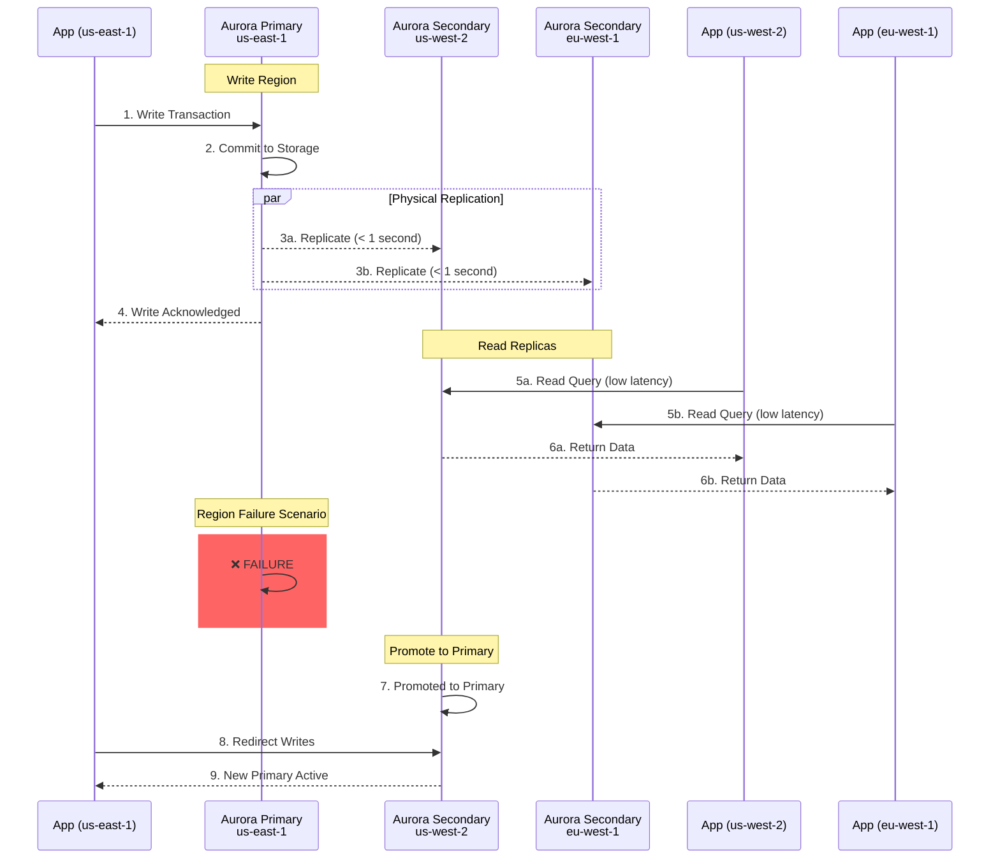
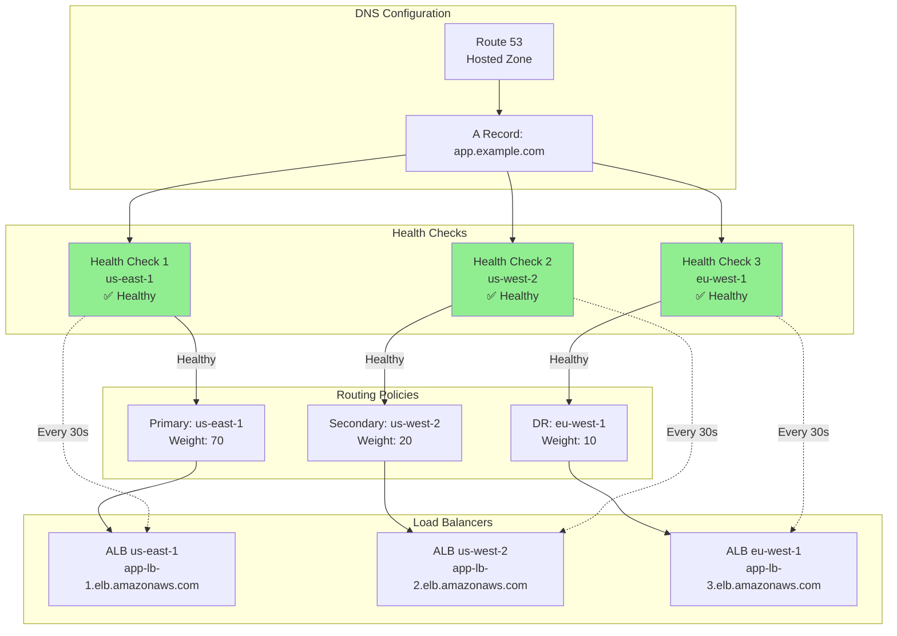
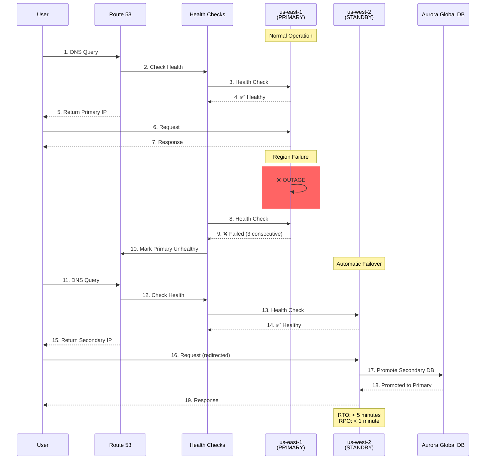
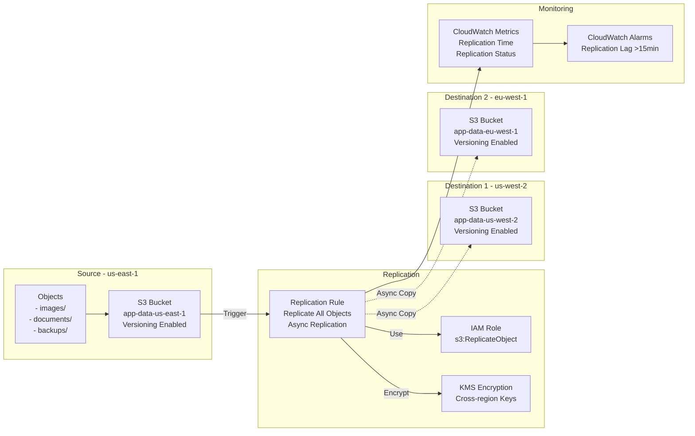
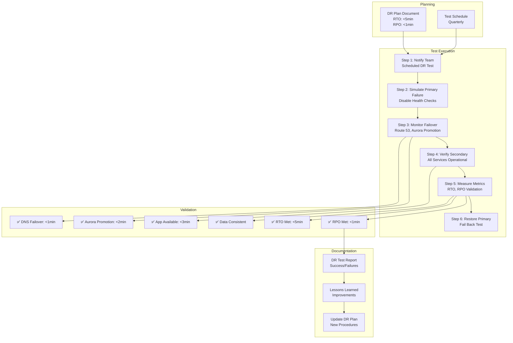
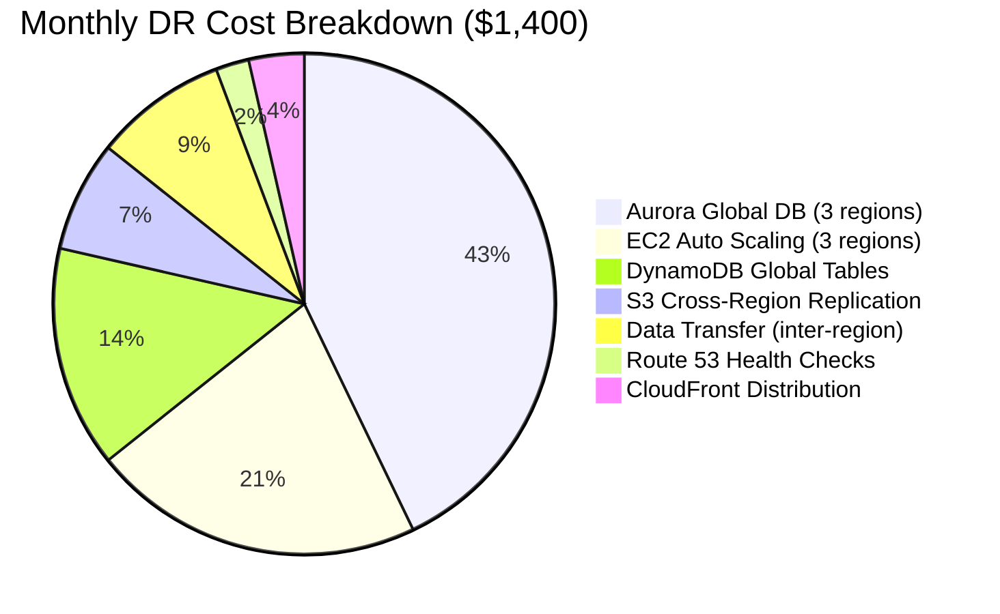
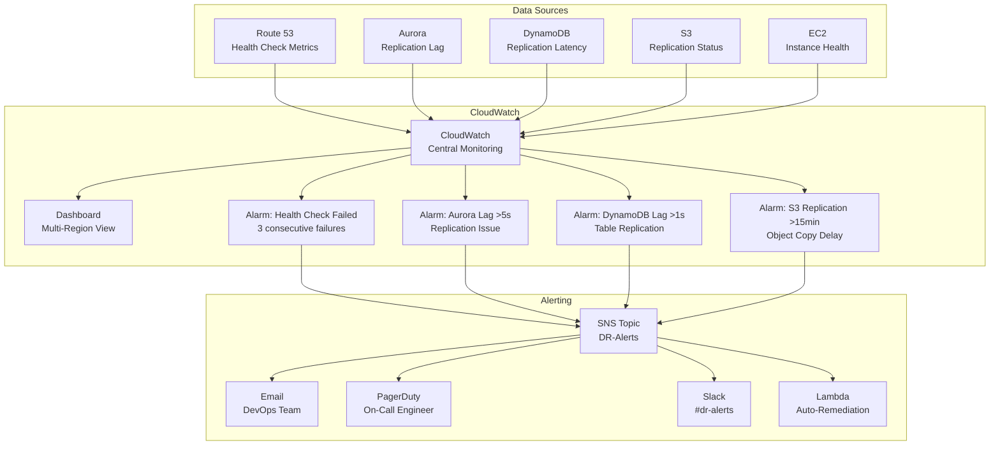
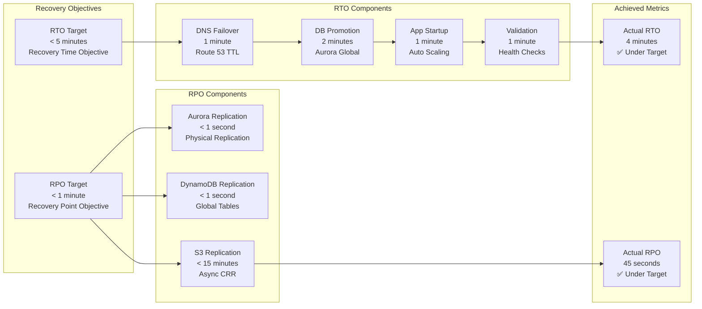

# Architecture Diagrams - Multi-Region Disaster Recovery

Comprehensive Mermaid diagrams for the enterprise multi-region DR infrastructure.

## 1. Multi-Region Active-Active Architecture



## 2. Aurora Global Database Replication



## 3. DynamoDB Global Tables

```mermaid
graph TB
    subgraph Applications
        App1[App us-east-1<br/>Write/Read]
        App2[App us-west-2<br/>Write/Read]
        App3[App eu-west-1<br/>Write/Read]
    end
    
    subgraph Global Table - "orders"
        Table1[DynamoDB Table<br/>us-east-1<br/>Replica 1]
        Table2[DynamoDB Table<br/>us-west-2<br/>Replica 2]
        Table3[DynamoDB Table<br/>eu-west-1<br/>Replica 3]
    end
    
    subgraph Replication
        Stream1[DynamoDB Streams<br/>Change Data Capture]
        Conflict[Conflict Resolution<br/>Last Write Wins]
    end
    
    App1 -->|Write| Table1
    App2 -->|Write| Table2
    App3 -->|Write| Table3
    
    App1 -->|Read| Table1
    App2 -->|Read| Table2
    App3 -->|Read| Table3
    
    Table1 -->|Changes| Stream1
    Table2 -->|Changes| Stream1
    Table3 -->|Changes| Stream1
    
    Stream1 -->|Replicate| Table1
    Stream1 -->|Replicate| Table2
    Stream1 -->|Replicate| Table3
    
    Stream1 --> Conflict
    
    Note1[Typical Replication: <1 second<br/>Strong Eventual Consistency]
```

## 4. Route 53 Health-Based Failover



## 5. Failover Scenario - Primary Region Failure



## 6. S3 Cross-Region Replication



## 7. Disaster Recovery Testing Flow



## 8. Cost Distribution Across Regions



## 9. Monitoring & Alerting Architecture



## 10. RTO & RPO Metrics



---

## Key Features

### 1. Multi-Region Active-Active
- 3 AWS regions: us-east-1, us-west-2, eu-west-1
- Active traffic in all regions
- Weighted routing (70/20/10)

### 2. Data Replication
- **Aurora Global Database**: <1 second RPO
- **DynamoDB Global Tables**: Sub-second replication
- **S3 Cross-Region Replication**: Async backup

### 3. Automatic Failover
- **Route 53**: Health-based routing
- **CloudFront**: Origin failover
- **Aurora**: Automatic promotion

### 4. Recovery Objectives
- **RTO**: <5 minutes
- **RPO**: <1 minute
- Validated through quarterly DR tests

### 5. Cost Optimization
- Right-sized instances per region
- DynamoDB on-demand pricing
- S3 lifecycle policies

---

**Author**: Rahul Ladumor  
**License**: MIT 2025
